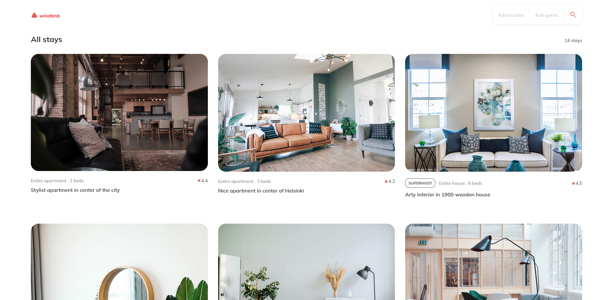
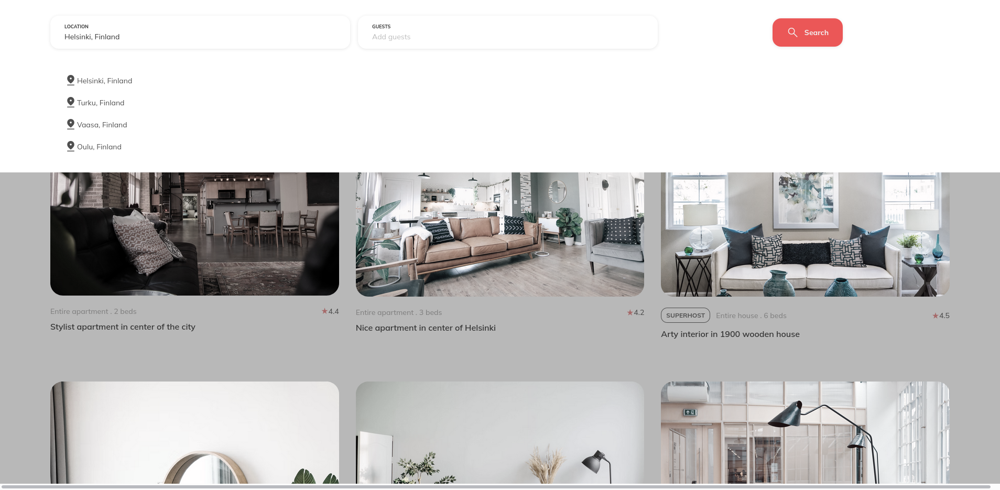
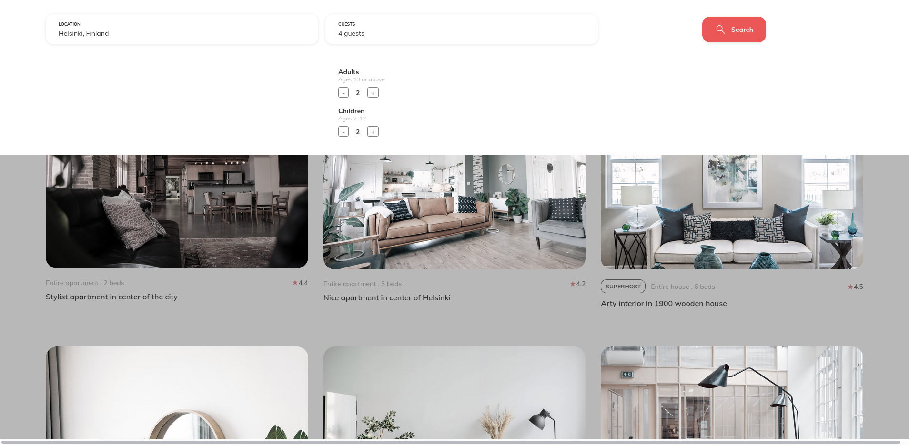
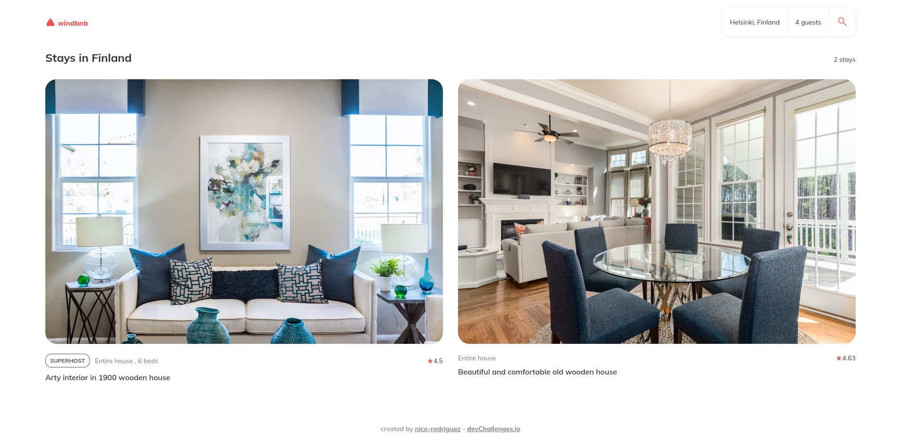
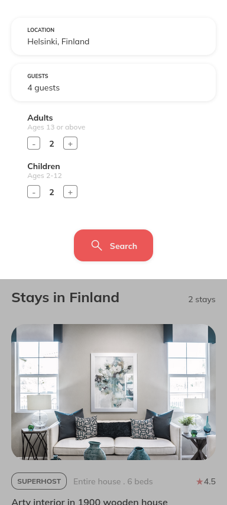
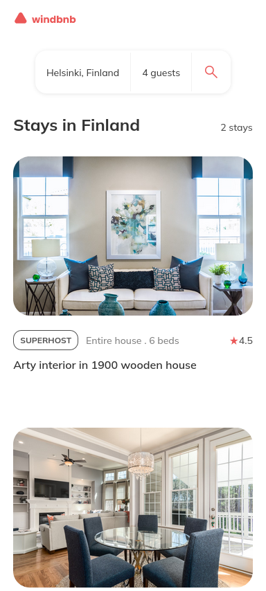

<h1 align="center">Windbnb</h1>

   Solution for a challenge from  <a href="http://devchallenges.io" target="_blank">Devchallenges.io</a>.

  <h3>
    <a href="https://windbnb-321353.netlify.app/">
      Solution
    </a>
     | 
    <a href="https://devchallenges.io/challenges/3JFYedSOZqAxYuOCNmYD">
      Challenge
    </a>
  </h3>

## Overview

Visit [https://windbnb-321353.netlify.app/](https://windbnb-321353.netlify.app/).

### Desktop

Filter by location

Filter by number of guests

Display the search results

### Mobile

Filter by number of guests

Display the search results

### Built With

- [React](https://reactjs.org/)

## Features

This application/site was created as a submission to a [DevChallenges](https://devchallenges.io/challenges) challenge. The [challenge](https://devchallenges.io/challenges/3JFYedSOZqAxYuOCNmYD) was to build an application to complete the given user stories.

It features:

- A filter drawer which opens when clicking the header buttons.
- The filter closes either by clicking the Search button or clicking outside of the filter.
- Properties may be filtered by location and number of guests.
- Display filtered properties number.
